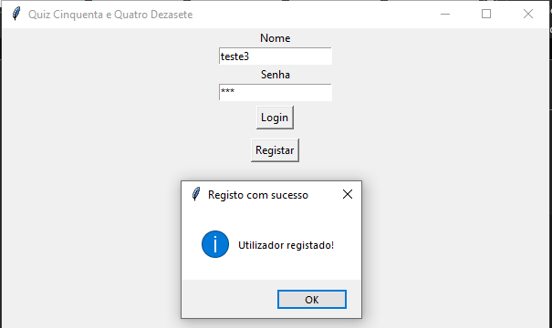
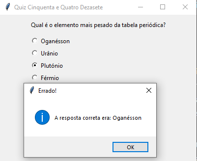
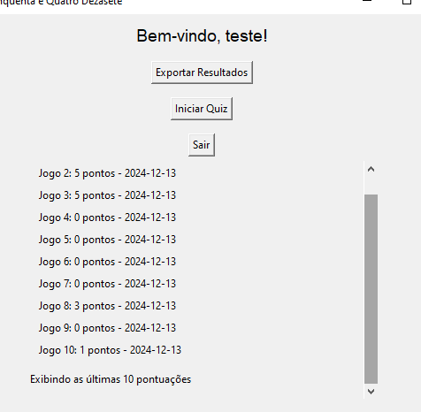
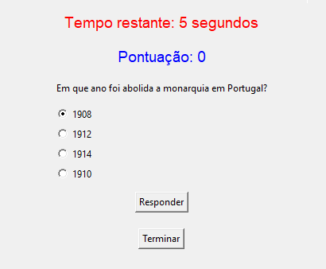

# Quiz Interativo em Python

Este é um projeto desenvolvido em Python e o objetivo é construir um quiz interativo, utilizando a biblioteca Tkinter para a interface gráfica e SQLite para o armazenamento dos dados. O objetivo do jogo é responder corretamente às perguntas apresentadas e acumular pontos.

## Funcionalidades

- **Registo e Login de Utilizadores**: Cada utilizador pode criar uma conta e aceder aos resultados através da exportação para excel e ingame.
- **Histórico de Pontuações**: Exibe as 10 últimas pontuações de cada utilizador no menu principal.
- **Quiz Dinâmico**: Perguntas retiradas aleatoriamente da base de dados com limite de tempo para cada resposta.
- **Exportação de Resultados**: Permite exportar o histórico de pontuações para um ficheiro Excel.
- **Interface Funcional**: Design funcional com elementos gráficos.

## Tecnologias Utilizadas

- **Python 3.13**
- **Tkinter**: Para criar a interface gráfica.
- **SQLite**: Para gestão da base de dados.
- **openpyxl**: Para exportação de dados para Excel.

## Screenshots










## Como Usar

1. Clone este repositório:
   ```bash
   git clone https://github.com/dblouro/5417_quiz-questions_project2.git
   cd quiz-interativo
